# Vyra Chat Sales Agent

## 1. Product definition

The Vyra Chat Sales Agent is a WhatsApp-based AI sales assistant for Dubai luxury and exotic car-rental operators. It handles the first part of the customer journey: understanding an enquiry, collecting the facts needed to evaluate it, answering verified questions, presenting suitable options, and creating a controlled handoff to a salesperson.

The agent is a sales coordinator, not an operations system. It may request approved prices, availability, requirements, and delivery information from the Operations Agent, then explain those facts to the customer. It must not manage inventory, edit vehicle status, control delivery, verify payments, approve documents, or confirm a booking.

The intended journey is:

`Customer enquiry → AI qualification → verified options/quote → human sales handoff → confirmed booking`

This reflects Vyra's product context and WhatsApp brief:

- [Project context](https://github.com/usamasaleem/Vyra/blob/main/docs/PROJECT-CONTEXT.md)
- [WhatsApp agent brief](https://github.com/usamasaleem/Vyra/blob/main/docs/WHATSAPP-AGENT-BRIEF.md)
- [Current state](https://github.com/usamasaleem/Vyra/blob/main/docs/CURRENT-STATE.md)

## 2. Outcomes

### Customer outcomes

- Receive a fast first response on WhatsApp.
- Explain what they need in natural language instead of completing a long form.
- See relevant vehicles and transparent, verified terms.
- Know which details are still missing.
- Understand when a human must review or confirm something.
- Avoid repeating information after handoff.
- Receive clear next steps and realistic response expectations.

### Operator outcomes

- Reduce repetitive questions handled manually.
- Capture more complete enquiries.
- Respond consistently across shifts and salespeople.
- Prevent unsupported promises about availability, price, deposits, or delivery.
- Route high-intent or sensitive conversations to the right person.
- Preserve customer context and ownership.
- Measure enquiry volume, response speed, conversion, and lost opportunities.

### Business outcomes

- Increase qualified enquiries reaching salespeople.
- Improve speed-to-lead without surrendering commercial control.
- Create an auditable record of what was asked, answered, quoted, and approved.
- Build a reliable foundation for inventory, booking, and sales analytics integrations.

## 3. Users and actors

| Actor | Needs | Authority |
|---|---|---|
| Customer / renter | Vehicle, date, price, requirements, delivery, and booking guidance | Can provide or correct their own details |
| AI sales agent | Qualify, answer, recommend, summarize, and route | Only uses approved data and configured actions |
| Salesperson | Continue conversation, negotiate within policy, and close booking | Can approve commercial actions assigned to their role |
| Sales manager | Monitor queue, reassign ownership, approve exceptions, review performance | Can override assignments and policies |
| Operations / fleet staff | Maintain vehicles, status, delivery, and rental conditions | Authoritative source for operational facts |
| System administrator | Configure businesses, users, policies, prompts, integrations, and retention | Full configuration authority |
| External systems | WhatsApp, CRM, inventory, calendar, payments, identity/document tools | Provide machine-readable events or records |

## 4. Core principles

1. **Approved data determines facts.** The agent should answer from the operator's current knowledge and inventory sources.
2. **Verification before commitment.** Availability, price, deposit, delivery timing, and eligibility must be checked at the appropriate point.
3. **Human control over consequential decisions.** Discounts, exceptions, payment verification, and final booking confirmation remain human-controlled in the initial product.
4. **Honest uncertainty.** If the agent cannot verify an answer, it says so and creates a next action.
5. **One conversation, one owner.** The system must make it clear whether the AI or a salesperson is responsible for the next reply.
6. **Context survives handoff.** The salesperson receives a concise, structured summary and the original conversation.
7. **Minimum necessary data.** Collect only what is needed for qualification, fulfillment, compliance, or support.
8. **Every important action is traceable.** Record source, timestamp, actor, decision, and status for material claims and state changes.

## 5. Feature map

> **Ownership rule:** Inventory, fleet, availability, delivery, booking, payment, documents, maintenance, active-rental support, and operational reporting are owned by the [Operations Agent](../Operations%20Agent/operations%20agent.md). The Sales Agent requests approved facts and communicates them; it does not manage those records.

### A. WhatsApp conversation layer

- Receive inbound WhatsApp text messages and webhook events.
- Send replies, option lists, structured questions, confirmations, and human-handoff notices.
- Support free-form language, common spelling errors, and incomplete answers.
- Detect language and respond in the configured language; initial launch can prioritize English with Arabic support planned.
- Recognize returning customers and resume an open enquiry when identity can be matched safely.
- Handle out-of-hours messages with an honest service-hours response and a queued follow-up.
- Protect against duplicate webhook events and repeated outbound messages.
- Track delivery, failure, read, and response events where available.
- Use approved WhatsApp templates for business-initiated follow-ups, subject to the channel's current rules and account configuration.

### B. Intent and qualification

The agent should identify the customer's primary intent:

- Rent a specific vehicle.
- Find a vehicle by category, make, budget, or experience.
- Compare several options.
- Ask for a price or quote.
- Ask about availability.
- Ask about deposit, insurance, kilometres, fuel, Salik, fines, or damage.
- Ask about delivery or collection.
- Ask about driver and document requirements.
- Modify, extend, or cancel an existing rental.
- Report an issue or request support.
- Speak to a human.
- Send a complaint or dispute.
- Ask an unrelated or unsafe question.

For a new rental enquiry, capture:

- Desired vehicle or category.
- Start date/time and end date/time.
- Rental duration.
- Delivery or collection location.
- Customer status: UAE resident, visitor, or unknown.
- Driver age and licence/document status when relevant.
- Number of drivers.
- Budget or price sensitivity, if volunteered or useful.
- Intended use when policy requires it.
- Contact identity and preferred follow-up channel.
- Special requirements such as child seat, airport delivery, chauffeur, event use, or cross-emirate travel.

The agent should ask one or two high-value questions at a time, acknowledge already supplied information, and avoid making the customer repeat themselves.

### C. Approved options from Operations

The Sales Agent asks Operations for current vehicle options, availability status, and applicable terms. Sales may explain and compare the returned options, but Operations owns fleet records, availability, vehicle status, and inventory changes. Sales never reserves or edits a vehicle.

### D. Pricing and quote support

Pricing must be explicit about what is known and what is conditional. The agent can:

- Calculate a draft total from approved rate cards and rental dates.
- Separate rental price from deposit, VAT, delivery, extras, and potential post-rental charges.
- Show daily, weekly, monthly, or event packages when configured.
- Explain included kilometres and extra-kilometre rates.
- State whether the quote is an estimate, a pending quote, or an approved quote.
- Record quote version, source, timestamp, currency, and expiry.
- Ask a salesperson to approve discounts or non-standard terms.
- Send a quote summary for human approval before it becomes a commercial commitment.

The agent must not conceal fees, change a price because the customer is uncertain, or claim that a payment or deposit has been received without a trusted payment event.

### E. Requirements and eligibility guidance

The agent can explain operator-configured requirements such as age, driving licence, passport, visa or entry documentation, Emirates ID, international driving permit, authorized-driver rules, and payment instrument requirements.

Requirements may vary by customer nationality, residency, vehicle category, age, rental duration, and operator policy. The agent should ask for the minimum information needed and escalate uncertain cases rather than making a legal determination.

For example, a high-performance or exotic vehicle may have a higher minimum age or stricter deposit policy than a standard luxury vehicle. The salesperson or operator system must make the final eligibility decision.

### F. Operational requests routed to Operations

The Sales Agent captures the customer's delivery, collection, extension, handover, or support request and sends it to Operations. Operations owns delivery capacity, timing, handover execution, live-rental changes, and service recovery. Sales communicates approved updates to the customer.

### G. Human handoff and shared ownership

Handoff is a first-class product capability. A handoff should include:

- Customer identity and WhatsApp number.
- Conversation link and full transcript.
- Intent and qualification stage.
- Requested dates, vehicle, location, and budget.
- Facts already verified.
- Open questions and unresolved risks.
- Quote or options already shown.
- Customer sentiment and urgency.
- Recommended next action.
- Reason for handoff.
- Assigned salesperson, queue, priority, and SLA.

Typical handoff triggers:

- Customer explicitly asks for a person.
- Final availability or booking confirmation is required.
- Discount or exception is requested.
- Payment, deposit, refund, dispute, or identity verification is involved.
- The customer is angry, confused, vulnerable, or reports a safety issue.
- The agent cannot verify a material fact.
- The customer has a complex multi-vehicle, long-term, corporate, event, or cross-emirate request.
- The conversation enters an unsupported intent.

After handoff, the AI should pause or operate in a clearly configured assistive mode. It must not compete with the assigned salesperson. Ownership changes must be visible and auditable.

### H. Follow-up and pipeline management

The agent can create structured stages:

`New → Qualifying → Options sent → Quote requested → Quote sent → Awaiting customer → Human review → Booking pending → Confirmed → Rental active → Completed / Lost`

Follow-up features:

- Remind the salesperson about unanswered or ageing enquiries.
- Send approved follow-ups when the customer has consented and the channel rules allow it.
- Stop automated follow-up after opt-out, complaint, handoff, or booking completion.
- Record why an enquiry was lost: unavailable vehicle, price, eligibility, no response, timing, competitor, or unknown.
- Reopen an enquiry when the customer replies.

### I. Sales workspace and administration

The Sales Agent workspace covers conversations, qualification, quotes, ownership, handoffs, follow-ups, and customer-facing messages. Inventory, fleet, availability, delivery, maintenance, booking, payment, document, and operational performance controls belong to the Operations Agent.

## 6. End-to-end use cases

### Use case 1: New customer asks for a Lamborghini

1. Customer sends “I need a Lamborghini from Friday to Sunday.”
2. Agent confirms dates and asks for delivery/collection location.
3. Agent asks whether the customer has a specific model or budget.
4. Inventory service returns matching vehicles and status.
5. Agent presents two or three verified options with clear terms.
6. Customer selects one and asks for the total.
7. Agent prepares a draft quote or requests human approval.
8. Salesperson receives the summary and confirms availability.
9. Customer receives a human-approved quote and next steps.

### Use case 2: Requested vehicle is unavailable

The agent states that it cannot confirm the requested vehicle for the dates, offers verified alternatives, and asks whether the customer is flexible on model, dates, or budget. It creates a follow-up task if the operator should check partner inventory.

### Use case 3: Discount request

The agent acknowledges the request, collects the commercial context, and routes it to an authorized salesperson. It must not promise that the discount will be accepted.

### Use case 4: Tourist with document questions

The agent explains the operator's configured document checklist, marks eligibility as pending if any factor is uncertain, and routes the case to a salesperson or compliance workflow. It should not provide a definitive legal opinion.

### Use case 5: Same-day delivery

The agent collects vehicle, location, timing, and customer readiness. It checks current inventory and creates an urgent logistics or sales task. It says “pending confirmation” until an authorized person or system confirms delivery.

### Use case 6: Existing renter wants an extension

The agent identifies the rental, captures the requested extension, checks whether the vehicle remains available, and routes pricing and approval to the assigned salesperson or operations team.

### Use case 7: Payment or deposit dispute

The agent acknowledges the issue, avoids arguing or assigning blame, captures the rental and transaction reference, pauses sales automation, and escalates to a human with high priority.

### Use case 8: Customer asks for a human

The agent immediately explains that it will connect them, captures the reason if possible, assigns or queues the conversation, and tells the customer what to expect next.

### Use case 9: Customer stops responding

The system marks the enquiry as awaiting customer, schedules only approved follow-ups, and closes or archives it according to operator policy. A late reply must reopen the conversation with its prior context.

### Use case 10: Returning customer

When identity is matched safely, the agent can reference an open enquiry or prior preference, but it should confirm critical details rather than relying on stale memory.

## 7. Conversation state and data model

A conversation record should include:

- Conversation ID, business ID, WhatsApp number, and customer identity.
- Current stage, intent, priority, owner, and AI mode.
- Structured rental request.
- Vehicle/options shown and their source timestamps.
- Quote records and approval state.
- Required documents and eligibility state.
- Handoff reason, owner, SLA, and next action.
- Consent, opt-out, and communication preferences.
- Message IDs, delivery status, and webhook event IDs.
- Audit events and source references.
- Created, updated, last customer message, and last staff response timestamps.

Every extracted field should carry confidence or provenance where practical:

`value + source message + extracted time + confidence + verification state`

Suggested verification states:

- `unknown`
- `customer-stated`
- `system-verified`
- `human-confirmed`
- `expired`
- `conflicting`

## 8. Safety, trust, and operational controls

The initial product needs:

- Duplicate-event protection and idempotent message handling.
- Retry and recovery for failed outbound messages and background jobs.
- Rate limits and abuse protection.
- Prompt and tool boundaries so the model cannot call unauthorized actions.
- Redaction and access controls for identity documents and payment information.
- Tenant isolation between rental operators.
- Role-based permissions.
- Audit logs for quotes, assignments, policy changes, and human overrides.
- Clear opt-out and deletion handling.
- Retention rules for conversations and documents.
- Human escalation for complaints, threats, accidents, safety issues, payment disputes, and suspected fraud.

UAE personal-data handling should be designed with the Federal Decree Law No. 45 of 2021 in mind. The official UAE government summary highlights confidentiality, lawful processing, data-subject rights, and controls for cross-border transfer and sharing: [UAE data protection laws](https://u.ae/en/about-the-uae/digital-uae/data/data-protection-laws). This document is a product design reference, not legal advice; the operator should validate its notices, consent, retention, processor arrangements, and regional requirements.

Rental policies are operator-specific. Public Dubai rental terms commonly vary on deposits, included kilometres, delivery, documents, driver age, and post-rental charges. The agent therefore must treat each operator's published and internal policy as authoritative rather than generalizing from another rental company. Examples of market variation include [Luxury Cars of Dubai terms](https://luxurycarsofdubai.com/terms/), [NCK delivery and deposit information](https://www.nckcarrental.com/services/luxury-car-rental-service/), and [Lux Motors requirements](https://luxmotorsdxb.com/terms-and-conditions/).

## 9. Metrics

### Customer experience

- First-response time.
- Time to first useful answer.
- Qualification completion rate.
- Customer effort: messages or turns to a qualified enquiry.
- Handoff acceptance rate.
- Customer opt-out and complaint rate.

### Sales performance

- Qualified enquiries per day.
- Enquiry-to-quote rate.
- Quote-to-booking rate.
- Time from enquiry to human response.
- Time from quote to booking.
- Lost-enquiry reasons.
- Revenue or booking value influenced by the agent.
- Repeat-customer rate.

### Reliability and control

- Verified-answer rate.
- Unsupported-claim rate.
- Availability freshness and mismatch rate.
- Duplicate-message rate.
- Webhook processing success rate.
- Handoff SLA breaches.
- AI-to-human takeover accuracy.
- Percentage of conversations with complete audit trails.

## 10. Recommended delivery phases

### Phase 1: Reliable text qualification

- Inbound and outbound WhatsApp text.
- Intent detection.
- Structured rental requirements.
- Approved FAQ and policy answers.
- Basic conversation memory.
- Human request and manual handoff.
- Message deduplication, retries, logging, and operator isolation.

### Phase 2: Sales workspace

- Shared inbox.
- Assignment and ownership.
- Queue and SLA controls.
- Internal notes.
- Conversation search.
- Follow-up tasks.
- Basic funnel reporting.
- AI pause/resume.

### Phase 3: Trusted inventory and quote support

- Inventory integration.
- Availability freshness.
- Vehicle recommendations.
- Rate cards and draft quotes.
- Quote approval workflow.
- Delivery and logistics tasks.
- Alternative-vehicle suggestions.

### Phase 4: Booking and lifecycle integrations

- Booking record creation after human approval.
- Payment and deposit status from a trusted provider.
- Document collection and verification workflows.
- Rental extensions, returns, and support.
- Customer history and repeat-renter preferences.
- Operational notifications.

### Phase 5: Optimization

- Multilingual quality improvements.
- Lead scoring and prioritization.
- Sales coaching and conversation analytics.
- Experimentation on approved messaging.
- Partner inventory and marketplace integrations.
- Forecasting and operator-level insights.

## 11. Definition of done for the first production-worthy version

The first version should not be considered ready until it can:

- Receive and process duplicate or delayed WhatsApp events safely.
- Preserve conversation context across restarts and handoffs.
- Answer approved FAQs with source-backed content.
- State uncertainty when a fact is not verified.
- Capture a complete rental enquiry.
- Stop or escalate when a human decision is required.
- Assign one clear owner to every active conversation.
- Produce a useful handoff summary.
- Prevent unauthorized discounts, payment claims, and final booking confirmations.
- Record audit events for material decisions.
- Protect data across operators and roles.
- Recover from failed messages and background jobs.
- Demonstrate performance with simulated traffic and representative conversations.

## 12. Sales and Operations boundary

The Sales Agent owns customer intent, qualification, recommendations from approved data, quotes as commercial conversations, handoffs, and sales follow-up. The Operations Agent owns inventory, vehicle status, availability, rate inputs, bookings, documents, payments, delivery, active-rental support, and operational reporting. Sales requests operational facts and displays the returned status; it does not edit or override those records.

See [Operations Agent](../Operations%20Agent/operations%20agent.md) for the operational ownership model.

### Product boundary

The sales agent should be excellent at qualification, explanation, recommendation, and coordination before it attempts autonomous booking. The highest-value early capability is dependable context and handoff: every customer should reach a salesperson with the right facts, the right urgency, and no invented promises.


## 13. Customer journey: what the user experiences

The customer should experience one continuous conversation even though several systems and people may participate behind the scenes. The agent should always make the next step obvious.

### Stage 0: Entry and first response

**Customer experience**

The customer sends a message such as “How much for a Ferrari this weekend?” or taps a WhatsApp button from a website, advertisement, Instagram profile, or referral. The agent responds quickly, identifies itself as the rental assistant, acknowledges the request, and asks the smallest useful next question.

**System behavior**

- Create or reopen a conversation.
- Store the inbound message and channel metadata.
- Detect language and likely intent.
- Check whether an open conversation or booking already exists.
- Start a qualification timer and assign an initial queue.
- Mark the customer as new, returning, or unresolved identity.

**Success condition:** The customer knows the enquiry was received and what information is needed next.

### Stage 1: Discovery and qualification

The agent asks for dates, vehicle preference, location, and any detail that materially changes the answer. It accepts partial replies such as “tomorrow,” “for 3 days,” “near Marina,” or “something sporty under 1,000,” but confirms normalized dates and times instead of assuming them.

The system extracts structured fields, keeps the original wording, tracks missing or conflicting values, asks one or two high-value questions at a time, detects urgency, and saves a draft enquiry even if the customer leaves early.

**Success condition:** The system has enough information to search inventory or knows exactly what is missing.

### Stage 2: Options and explanation

The customer receives a small set of relevant options with verified model, dates, price basis, deposit, included kilometres, delivery terms, and important requirements. Each option is labeled as available, pending confirmation, unavailable, or unknown. The customer can ask follow-up questions without restarting.

The system records the source timestamp for availability and pricing, stores options shown, and marks whether each is a recommendation, draft quote, or approved offer. A displayed option is never treated as reserved.

### Stage 3: Quote and commercial review

The agent separates rental charge from deposit, delivery, VAT, extras, and possible post-rental charges. Estimates are labeled as estimates. Discounts, unusual durations, multi-car requests, and non-standard terms create a human approval task. A draft quote never becomes a booking by implication.

A quote record should include components, currency, source, timestamp, expiry, approval state, and the person or system that approved it.

### Stage 4: Handoff to a salesperson

The customer is told why a human is needed and is not asked to repeat the conversation. The handoff packet includes the transcript, summary, contact, intent, stage, urgency, dates, location, vehicle, budget, requirements, verified facts, unresolved questions, options shown, quote versions, reason for handoff, next action, owner, priority, and SLA.

Customer-facing AI automation pauses by default. In assistive mode, the AI may summarize or draft a reply for the salesperson but must not send independently. The success condition is one visible owner and one coherent next reply.

### Stage 5: Booking confirmation

The customer must be able to distinguish between enquiry, quote sent, payment pending, reserved, and confirmed. Confirmation includes vehicle, dates, price, deposit, delivery or collection, documents, cancellation terms, and contact person.

The system rechecks availability, requires the configured approval and booking events, records who confirmed, links the booking to the conversation, stops lead follow-ups, and stores a final agreed-terms snapshot.

### Stage 6: Pre-handover and active rental

The agent may support document reminders, delivery timing, handover instructions, extension requests, and roadside-support routing. It must not silently alter a live rental. Extensions, vehicle swaps, damage, fines, accidents, payment disputes, and late returns create explicit operational tasks and human ownership.

### Stage 7: Completion, retention, and re-entry

After return, the system can mark the rental complete, record unresolved charges or disputes, and request feedback through an approved workflow. Returning-customer preferences may improve discovery, but dates, vehicle, price, eligibility, and payment details are revalidated.

## 14. Conversation state machine

| State | Meaning | Customer-facing behavior | Exit condition |
|---|---|---|---|
| New | First message received, intent unresolved | Acknowledge and clarify | Intent detected |
| Qualifying | Required rental details incomplete | Ask targeted questions | Minimum fields complete or escalation |
| Awaiting verification | Answer depends on inventory, price, eligibility, or operations | Explain what is being checked | Verified answer or human review |
| Options sent | Candidate vehicles or terms shown | Answer questions and capture preference | Customer chooses, changes request, or goes quiet |
| Quote pending | Draft quote needs approval or fresh availability | Label estimate and expectation | Quote approved, revised, or rejected |
| Awaiting customer | Customer must respond or provide information | Approved follow-up only | Reply, opt-out, timeout, or close |
| Human queued | Handoff created but not accepted | Give queue and expectation message | Owner accepts or manager reassigns |
| Human active | Salesperson owns the next reply | AI paused or assistive | Booking, closure, or return to AI |
| Booking pending | Customer or operator still has a required action | Show exact blocker and next step | Confirmed, cancelled, or expired |
| Confirmed | Booking has authoritative confirmation | Transition to lifecycle support | Rental starts or is cancelled |
| Support escalation | Issue, complaint, safety, fraud, or dispute | Acknowledge and route urgently | Human resolves or closes |
| Closed / lost | No active next action | Do not keep messaging automatically | New customer message reopens |

Every transition records actor, timestamp, reason, previous state, new state, and linked message or system event.

## 15. Edge-case playbook

### Ambiguous or incomplete input

- “This weekend” → ask for exact dates and timezone; store the original phrase.
- “Tomorrow” near midnight → confirm the calendar date using the business timezone.
- “A Ferrari” → ask whether model, budget, or driving experience matters.
- Missing return date → ask for duration or return date before quoting.
- Repeated date changes → confirm the latest version and mark prior quotes stale.

### Conflicting information

If the customer first says Friday and later says Saturday, summarize the conflict and ask which is correct. Do not silently overwrite the original. Conflicts between customer statements, inventory, rate cards, or booking records block a final commitment until verified.

### Stale or unavailable inventory

Recheck availability before quoting or confirming after a delay. If inventory is down, say live availability cannot be verified, offer a human check, save the enquiry, and never use old data as current.

### Price mismatch or discount request

Acknowledge differences between an advertisement, older quote, and current rate. Show the currently verified source, create salesperson review, and preserve quote versions. Never promise a discount or change an approved quote without an audit trail.

### Deposit and payment

Check trusted payment events rather than screenshots or customer assertions. Route deposit refunds, cash exceptions, payment disputes, and “remove the deposit” requests to the authorized team. Discourage sharing card numbers in chat and use the approved secure process.

### Eligibility and documents

If age, nationality, licence, visa, IDP, Emirates ID, or authorized-driver rules are unclear, mark eligibility pending and route to a human. Do not make a definitive acceptance or rejection from incomplete information. A readable document is not automatically a verified document.

### Safety, fraud, complaints, and legal escalation

Immediately hand off or escalate accidents, injuries, dangerous driving, threats, harassment, suspected fraud, identity theft, suspicious payment activity, damage or fine disputes, requests to falsify documents, and legal complaints. Acknowledge, avoid blame, preserve the record, and stop sales automation.

### Repeated human requests or angry customers

Repeated requests for a human are a handoff trigger. For an angry customer, switch from sales mode to service recovery, stop promotional follow-ups, capture only the minimum facts, and route to a person. Do not defend policy or continue recommending cars during an unresolved complaint.

### Language and low-confidence interpretation

For slang, spelling, voice transcription, or mixed languages, reflect the interpretation and ask for confirmation. Low-confidence dates require clarification; low-confidence requests for a final booking require human review.

### Duplicate or out-of-order events

Provider retries, duplicate customer messages, delayed receipts, and out-of-order events must not create duplicate replies, leads, or state changes. Use provider message IDs and idempotency keys; make state transitions conditional on the current version.

### Media and documents

Acknowledge received files, identify supported types, and route sensitive documents to the approved review workflow. Unsupported or corrupted files receive a clear re-upload request. The agent must not claim a document is valid merely because it is readable.

### Out-of-hours and queue delay

Tell the customer the current service expectation, capture the request, assign a queue, and avoid promising an exact callback time unless the business can meet it. Same-day urgency raises priority and creates an internal SLA.

### Opt-out and returning customer identity

Stop automated follow-up immediately after opt-out and preserve only the minimum operational record. Do not merge returning-customer records solely by name or preference; reconcile identity safely before exposing prior booking information.

### Multiple drivers, corporate, event, or long-term requests

Capture the primary customer, payer, and authorized drivers separately when needed. Multi-vehicle, corporate, event, and long-term requests become structured opportunities routed to a specialist rather than being forced into a single-car flow.

### Cancellation or change after confirmation

Retrieve the booking, explain the configured next step, and route refund, fee, date-change, and vehicle-change decisions to the authorized team. Never promise a refund or waive a fee autonomously.

### System or integration failure

Save the inbound request durably, tell the customer what cannot be verified, create a retry or incident task, prevent partial state from appearing confirmed, and resume from the saved conversation after recovery.

## 16. Human handoff contract

A handoff is complete only when a reason, queue or person, priority, SLA, customer expectation, transcript, summary, next action, and AI sending mode are recorded. It must be possible to accept, reassign, escalate, or close the handoff without losing context.

Suggested summary:

> **Customer:** [name / WhatsApp number]  
> **Request:** [vehicle/category, dates, duration, pickup/delivery]  
> **Budget:** [amount or unknown]  
> **Verified:** [facts and source times]  
> **Unresolved:** [questions, conflicts, approvals]  
> **Intent:** [buying signal / urgency]  
> **Options shown:** [vehicles and quote versions]  
> **Reason:** [specific handoff trigger]  
> **Next action:** [who must do what by when]

## 17. Journey-level acceptance scenarios

1. A new customer gives only a vehicle name; the agent asks for dates and does not invent a price.
2. Natural-language dates are normalized and confirmed before inventory search.
3. An unavailable car produces verified alternatives and preserves the original preference.
4. An expired quote is rechecked rather than repeated.
5. A discount request creates human review and no promise.
6. A human request stops qualification and creates a visible handoff.
7. A payment screenshot does not mark payment received.
8. An accident report stops sales automation and starts urgent routing.
9. A salesperson accepting a handoff prevents competing AI replies.
10. A duplicate webhook creates no duplicate message or lead.
11. Inventory failure saves the enquiry and sends an honest pending message.
12. Opt-out stops automated follow-up immediately.
13. A return after several days revalidates stale availability and price.
14. A changed date supersedes the old quote.
15. Cancellation routes policy decisions without promising a refund.

## 18. Recommended technology stack and implementation blueprint

### 18.1 Status and assumptions

This section is a proposed implementation, not a description of deployed software. The [current-state document](https://github.com/usamasaleem/Vyra/blob/main/docs/CURRENT-STATE.md) reports a WhatsApp prototype with successful outbound tests and webhook verification, but no durable memory, complete handoff, shared inbox, or inventory engine. The existing prototype's programming language, deployment, credentials, and code have not been audited here.

Assume a small team, a first pilot with one rental operator, text-first conversations, and eventual support for multiple operators. Preserve compatible prototype code after reviewing it. Do not migrate working components merely to match this recommendation.

### 18.2 Stack choices

| Layer | Recommended starting choice | What it does for Vyra | Tradeoff |
|---|---|---|---|
| Shared language | TypeScript on a supported Node.js LTS release | Shares data contracts across inbox, API, and workers | Runtime input validation is still required |
| Sales inbox | Next.js with React | Conversation list, messages, assignments, quote review, settings | Keep business rules in shared backend services |
| HTTP API | Fastify | Receives webhooks and authenticated staff commands | Separate API deployment adds modest operational work |
| Durable records | Supabase-managed PostgreSQL | Messages, leads, owners, quotes, policies, audit and outbox | Carefully design permissions and database migrations |
| Staff identity | Supabase Auth | Login and staff identity; membership table defines operator roles | Authentication alone does not establish tenant authorization |
| Files | Private object storage, initially Supabase Storage | Approved vehicle images and secure document uploads | Separate document access from ordinary inbox access |
| Background jobs | BullMQ with a compatible persistent Redis service | Model turns, sending, integration refreshes, reminders | Redis is an extra dependency; PostgreSQL remains the recovery source |
| AI | OpenAI Responses API through the official server-side SDK | Interpret messages and call narrow business tools | Choose a model using measured quality, latency, and cost |
| Channel | Direct Meta WhatsApp Cloud API | Receive customer messages and deliver replies | Operator onboarding and channel rules need explicit implementation |
| Pilot hosting | Render web services plus a background worker; Supabase for data | Run inbox, API, and persistent processing | Confirm plan, region, backups, and worker resources before provisioning |
| Delivery checks | GitHub Actions, TypeScript checks, integration tests, browser tests | Prevent unsafe releases and broken customer journeys | Test external failures as well as successful flows |
| Monitoring | Structured logs, error tracking, metrics and alerting | Find lost messages, queue delays, failed tools and missed handoffs | Redact customer content and secrets |

These are architectural recommendations. Next.js documents its React application framework, Fastify its server framework, BullMQ its Redis-backed queue, and Render its background worker deployment model. [T1–T4]

Start with one repository and shared modules, deployed as separate web/API and worker processes. A dedicated vector database, Kubernetes, and multiple cooperating AI agents are unnecessary for the first pilot. If the team already runs a reliable database-backed queue, it can replace BullMQ/Redis; do not run two job systems for the same responsibility.

### 18.3 How the pieces connect

```mermaid
flowchart TD
    C[Customer on WhatsApp] --> M[Meta Cloud API]
    M --> W[Webhook API]
    W --> D[(PostgreSQL: events and messages)]
    D --> R[Outbox relay]
    R --> Q[Redis and BullMQ]
    Q --> O[Conversation worker]
    O --> A[AI interpretation and tool requests]
    A --> B[Backend rules and approved tools]
    B --> I[Inventory and policy sources]
    B --> D
    O --> S[Outbound dispatcher]
    S --> M
    U[Salesperson] --> UI[Sales inbox]
    UI --> B
    D --> UI
```



The database is the record of what happened. The queue schedules work. The AI proposes language and actions. Backend services authorize actions. The dispatcher is the only component that sends WhatsApp messages, including messages written by salespeople.

### 18.4 One message, from arrival to reply

Example: “Need a Ferrari tomorrow for three days, deliver to Marina.”

1. **Receive and authenticate.** The webhook endpoint verifies the provider signature against the untouched request body before trusting its contents. Resolve the business from the receiving WhatsApp account/phone-number mapping, never from text in the message.
2. **Save before acknowledging.** In one database transaction, persist the inbound event, deduplicate the provider message, and add a processing outbox record. Return success after durable acceptance. If storage fails, do not acknowledge success and lose the message.
3. **Schedule work.** An outbox relay publishes a job. If the queue is unavailable, the unsent outbox record remains recoverable. Publishing twice must be harmless.
4. **Load context.** The worker loads operator policy, conversation ownership, recent messages, structured enquiry fields, open approvals, and relevant source records.
5. **Interpret.** Extract vehicle preference, duration, location and proposed date. Resolve “tomorrow” relative to message time and the operator's timezone; ask the customer to confirm ambiguity. Do not assume which Ferrari or exact pickup time.
6. **Choose the next action.** Backend rules allow clarification, approved information retrieval, inventory lookup, or handoff. Human-owned conversations produce internal assistance only.
7. **Use tools if ready.** Search current inventory when the necessary inputs are known. A failed lookup produces an unknown result rather than invented availability.
8. **Prepare a reply.** Generate a short response referencing returned evidence. Use backend-rendered amounts and approved wording for quotes and confirmation status.
9. **Check current state again.** Reject stale output if the customer corrected the dates, a salesperson took over, or a relevant policy changed during generation.
10. **Save the send intent.** Store the validated outbound message with its conversation revision and logical idempotency key.
11. **Dispatch.** Check channel eligibility and ownership immediately before sending. Save the provider response identifier and subsequent delivery events.
12. **Update the inbox.** Staff see the persisted message and its true delivery state. Provider acceptance is distinct from delivery or reading.

This sequence is a proposed Vyra processing contract. Exact Meta payload fields, signature requirements, endpoint permissions and API version must be validated during channel integration; the technical Meta pages were not retrievable in this documentation pass.

### 18.5 WhatsApp setup and sending rules

For the pilot, connect the operator's authorized WhatsApp Business Account and number, configure production credentials, subscribe the required events, and expose a public HTTPS webhook. Verify inbound text, outbound text, status updates, credential rotation and revoked access separately; a successful verification challenge is not an end-to-end message test.

Keep secrets in server-side secret storage. Maintain an explicit mapping of operator, WhatsApp account, receiving number and credential reference. Never put provider access tokens into the browser or prompts.

WhatsApp's published policy allows ordinary replies within 24 hours of the last user message and requires approved templates outside that window. It also requires clear escalation paths for automation. Evaluate eligibility when a message is actually sent, including human-authored replies; a delayed job may cross the window boundary. Record opt-outs and prevent disallowed follow-ups. [T5]

A rejected or paused template should create an internal task instead of repeated sends. Human takeover changes who replies, not channel permissions. Do not ask customers to share full card or sensitive ID numbers in WhatsApp; use an approved secure collection flow where required. [T5]

For multiple operators, add a supported onboarding process for each account, permission lifecycle and offboarding. Do not assume the pilot account's credentials can serve unrelated businesses. Staff should use the shared inbox for pilot replies; any separate native-app/coexistence workflow needs explicit verification that ownership and message history stay synchronized.

### 18.6 Database design

Use UUIDs for internal identities, UTC timestamps for storage, an operator IANA timezone for interpretation/display, and integer minor units or exact decimal arithmetic for money. Never use floating-point arithmetic for totals.

| Table | Important fields | Responsibility |
|---|---|---|
| operators | id, name, timezone, service_hours, policy_version | Rental business configuration |
| memberships | operator_id, user_id, role, active | Staff access and authority |
| whatsapp_accounts | operator_id, provider_account_id, phone_number_id, secret_ref | Trusted channel routing |
| contacts | operator_id, channel_identifier, verified_identity_ref | Contact matching without assuming legal identity |
| conversations | operator_id, contact_id, owner_id, handler_mode, revision | Reply ownership and concurrency |
| enquiries | conversation_id, stage, requested_dates, vehicle_preferences, missing_fields | A customer can have multiple rental requests |
| messages | operator_id, conversation_id, provider_id, direction, kind, delivery_state | Durable conversation history |
| inbound_events | provider_event_key, payload_ref, received_at, processed_at | Ingestion audit and deduplication |
| outbox | event_type, aggregate_id, payload, status, attempts, next_attempt_at | Recoverable scheduling and sending intents |
| agent_runs | conversation_id, input_revision, prompt_version, model_id, result_state, usage | Explain and evaluate AI processing |
| field_evidence | enquiry_id, field, value, source_message_id, verification_state | Trace each extracted fact |
| knowledge_versions | operator_id, topic, version, approval, effective_dates | Approved policy text and provenance |
| vehicles / availability | operator_id, vehicle_id, intervals, source, checked_at | Fleet and dated availability |
| quotes / quote_lines | enquiry_id, revision, totals, valid_until, approval_id | Immutable commercial versions |
| handoffs / tasks | conversation_id, reason, queue, owner, due_at, status | Visible follow-through |
| approvals | action, subject_id, subject_version, approver, timestamp | Bind authority to the exact decision |
| bookings / payment_events | external_ref, authoritative_state, verified_by | Later-stage integrations |
| documents | private_object_ref, purpose, review_status, retention_until | Sensitive file handling |
| audit_events | actor, action, subject, timestamp, correlation_id | Accountable state changes |

Add unique constraints to deduplicate inbound provider messages within their operator/account scope and each logical outbound intent. Apply tenant-consistent foreign keys so a quote cannot reference another operator's enquiry.

Separate **sales stage**, **reply ownership**, **waiting reason**, and **booking status** into distinct fields. Earlier journey tables describe customer-visible situations; they should not become one overloaded database enum. “Awaiting customer” can coexist with “quote sent,” and “human active” can coexist with “booking pending.”

### 18.7 Authentication and operator isolation

Verify the staff session on every API call, then load active operator membership and required role. A browser-supplied operator ID is a requested scope, not proof of permission.

Use PostgreSQL row-level security for exposed tables as defense in depth. Supabase documents that privileged service keys can bypass RLS; keep them server-side and ensure privileged background jobs perform explicit operator scoping. [T6]

Test cross-operator access using guessed IDs, search, file links, subscriptions, exports and worker jobs. Background jobs receive internal IDs and reload trusted records; they do not inherit authorization from a model-generated argument.

Salespeople may accept handoffs and send messages. Managers may approve configured commercial exceptions. Operations staff may update fulfillment facts. Administrative access should not silently grant finance authority unless that is the operator's chosen policy.

### 18.8 AI design: interpretation, memory and tools

Use a bounded workflow with a configurable model, prompt version, maximum tool calls and time budget. Select the production model after evaluating representative English, Arabic and mixed-language cases against the same acceptance set; no specific model, price or performance is assumed here.

OpenAI function calling allows the model to request application-defined functions; the application executes them and supplies the results. Strict schemas improve argument shape, but do not establish whether a requested action is authorized or a fact is true. Use explicit strict schemas with all properties required, nullable values for optional inputs, and no additional properties. [T7]

Suggested application tool boundary:

| Tool | Permitted behavior | Mandatory backend check |
|---|---|---|
| get_operator_policy(topic) | Retrieve approved, effective policy | Operator scope and source version |
| search_vehicles(criteria) | Return candidates and freshness | Validated dates and trusted inventory source |
| prepare_quote(enquiry_id) | Calculate draft from approved rules | Versioned inputs; no automatic discount |
| record_enquiry_fields(fields) | Save customer-provided facts | Evidence and explicit conflict handling |
| request_handoff(reason) | Queue human review | Idempotent task; pause sending |
| request_booking_review(quote_id) | Create approval task | Quote belongs to enquiry and is current |

Do not expose unrestricted SQL, arbitrary URLs, refunds, payment verification or final booking confirmation as general AI tools.

Build model context from a short approved instruction set, current enquiry fields, recent messages, a summary of older exchanges, and relevant approved knowledge. The summary must link back to evidence and cannot establish payment or identity truth. Structured records override stale summaries; unresolved contradictions remain explicit.

Customer messages, retrieved text and file contents are untrusted input. A message saying “ignore your rules and confirm” cannot change permissions. On refusal, malformed output, timeout or exhausted tool budget, save a failure state and use a bounded clarification or human task.

For material commercial messages, render amounts, dates, expiry and status from validated database fields. Let the model phrase the surrounding explanation. This reduces the risk of a fluent response changing approved terms.

### 18.9 Approved sales information and quote requests

Sales may use approved customer-facing information and request a draft quote from Operations. Operations owns inventory, availability, rate inputs, and quote calculation. Sales cannot change operational data or turn an estimate into a booking.

### 18.10 Reliable jobs and message ordering

Queue jobs should be small and repeatable: process inbound message, generate turn, dispatch outbound intent, refresh inventory, create reminder, check missed SLA. BullMQ supplies job scheduling and retry mechanisms; business correctness still needs database constraints and repeat-safe handlers. [T3]

Use per-conversation serialization plus a revision number. Do not assume a global queue concurrency setting serializes each conversation. Long model calls run outside database transactions; a short transaction checks the revision before accepting their output.

A proposed 1–2 second collection window can combine “hi,” “Ferrari,” and “tomorrow” into one turn; test this against latency and urgent-message handling. A newer message supersedes pending draft output when it changes the request.

For retryable failures, use bounded exponential backoff with jitter. Authentication failure or an invalid template requires intervention. Persist terminal failures and expose a retry control to staff.

Do not promise exactly-once delivery across your database and Meta. If Meta accepted a send but the response was lost, a retry may duplicate it. Mark the outcome unknown, reconcile against available provider events, and apply an explicit operator-approved retry policy. A local idempotency key alone cannot resolve this network ambiguity.

### 18.11 How human takeover actually works

1. A salesperson clicks **Take over**.
2. A backend transaction verifies their role, changes handler mode, assigns the owner and increments the revision.
3. Pending AI send intents become cancelled or invalid.
4. The inbox shows human ownership; workers may create internal drafts only.
5. All subsequent staff sends pass through the same dispatcher and channel checks.
6. **Return to AI** requires an explicit action and reloads current context.

Serialize takeover commands and outbound sends through the same conversation coordinator. Define the boundary precisely: an AI message already submitted to Meta cannot be recalled by a later takeover. Show any in-flight send to the salesperson and suppress drafts that have not reached dispatch.

When nobody accepts a handoff, a scheduled task checks its due time, alerts the configured fallback owner, and keeps the queue item visible. A generated handoff summary without an assigned task is not a completed handoff.

### 18.12 Staff inbox and API outline

The first inbox needs conversation list, thread, customer/enquiry fields, owner and mode, next action, source freshness, delivery errors, handoff queue, internal notes and manual reply. Add quote approval and knowledge publishing as those services become available.

Example application endpoints, not provider API paths:

| Endpoint | Behavior |
|---|---|
| GET /webhooks/whatsapp | Provider verification challenge |
| POST /webhooks/whatsapp | Authenticate and durably accept events |
| GET /conversations | Authorized operator-scoped list |
| POST /conversations/:id/takeover | Atomic ownership change |
| POST /conversations/:id/messages | Validated manual send intent |
| POST /conversations/:id/resume-ai | Explicit return to automation |
| POST /enquiries/:id/quotes | Deterministic quote draft |
| POST /quotes/:id/approve | Role check and version-bound approval |
| POST /handoffs/:id/accept | Record accepting owner |
| POST /knowledge/:id/publish | Publish approved policy version |

Use polling initially if it makes the pilot simpler. Later use authenticated realtime notifications to refresh records; reconnecting clients must reload from the database rather than assume every event arrived. Never expose internal notes to the outbound dispatcher.

### 18.13 Documents and payment integrations

Add these after the basic handoff works. Use short-lived secure upload links with explicit purpose, restricted file types/size, malware handling and private storage. Do not place raw ID documents in logs or ordinary model context. OCR can assist review but cannot mark identity verified.

Use provider-hosted checkout when payment integration is introduced. Verify payment webhooks independently, match operator, booking, amount and currency, and deduplicate events. Provider payment state and human payment approval remain separate: in Vyra's initial scope, staff retain verification authority. A successful payment never automatically establishes vehicle availability or booking confirmation.

### 18.14 Deployment and repository layout

Suggested code organization alongside the existing documentation:

```text
apps/
  inbox/                 Sales workspace
  api/                   Webhooks and staff API
  worker/                Conversation processing and dispatch
packages/
  contracts/             Runtime schemas and shared types
  domain/                Quote, ownership and approval rules
  db/                    Queries and migrations
  ai/                    Prompts, tools and evaluation fixtures
  integrations/          WhatsApp and inventory adapters
tests/
  integration/
  journeys/
  evaluations/
```

Develop with synthetic customer data and local database/queue services. Use a separate staging WhatsApp test setup, database, credentials and storage from production.

Deploy the web/API and persistent worker as separate processes. Render documents background workers for continuous queue processing. [T4] The proposed provider combination is a pilot convenience, not a claim about UAE hosting or legal suitability; confirm residency, transfer and contractual requirements before choosing regions.

Store secrets outside Git. Run migrations as a controlled release step, use backward-compatible schema changes, then deploy API and workers. Provide health checks for database, queue and worker heartbeat. Test backup restoration, not just backup creation. An AI kill switch must disable AI sends while preserving ingestion and staff access.

### 18.15 Monitoring, performance and cost

Track the full chain with a correlation ID: inbound event → job → agent run → tool request → send intent → provider result. Redact content by default in infrastructure logs; keep authorized conversation history in the product database.

Suggested pilot targets, to measure rather than promise:

- Durable webhook acceptance p95 under 1 second in normal load.
- Ordinary text response p95 under 15 seconds, excluding human/external delays.
- Zero observed cross-operator leaks and unauthorized confirmations in release tests.
- Every unresolved send or handoff failure visible in the staff queue.

Alert on oldest unprocessed event, outbox backlog, missing worker heartbeat, failed authentication, rising send failures and missed handoff deadlines.

Estimate monthly cost from measured usage:

`hosting + database/backups + Redis + storage + monitoring + WhatsApp charges + AI tokens/tools`

For AI, calculate each model's input and output tokens against its current rates; include retries, summaries and tool-loop turns. For example, 1,000 enquiries with 12 model calls each means 12,000 calls before retries—an assumption, not a forecast. Measure a representative sample before purchasing larger plans. Use per-operator budgets, bounded context and tool limits; avoid dropping customer messages when a budget is reached, and route to humans instead.

### 18.16 Build order and release evidence

| Milestone | Build | Evidence required before moving on |
|---|---|---|
| 0. Audit prototype | Find existing code, webhook settings, number ownership and deployment | Real inbound and outbound test; inventory of reusable components |
| 1. Durable transport | Events, messages, outbox, queue, dispatcher | Restart and duplicate-event tests preserve one logical message |
| 2. Human inbox | Login, isolation, conversations, replies, takeover | Two operators cannot access each other; takeover suppresses unsent AI drafts |
| 3. AI qualification | Extraction, memory, approved FAQs, narrow tools | Dates, corrections, refusals and human requests pass journey tests |
| 4. Reliable handoff | Queue, owners, summary, SLA escalation | Unaccepted handoff reaches fallback owner without duplicate replies |
| 5. Inventory and quote drafts | Fleet adapter, freshness, exact calculator | Unavailable/stale source cannot produce a confirmed offer |
| 6. Controlled booking support | Version-bound staff approval and authoritative booking reference | Changed quote invalidates approval; payment alone cannot confirm |
| 7. Pilot rollout | Shadow evaluation, limited live traffic, monitoring | Staff can stop AI instantly and recover every failed task |

The original feature roadmap lists a fuller sales workspace as Phase 2. Implementation should still provide a minimal human reply/takeover interface before any customer-facing AI pilot; that is a dependency of safe handoff.

Start in shadow mode: the AI drafts against test or appropriately authorized conversations while humans send. Move to limited automatic clarification and FAQs only after evaluation. Expand allowed actions individually.

### 18.17 Technical failure tests

Test observable outcomes, not just prompt wording:

- Duplicate inbound event during a worker restart: one durable customer message and no duplicate logical response.
- Database succeeds but queue publish fails: outbox later schedules processing.
- Two customer messages arrive during generation: stale output is discarded or regenerated.
- Human takeover races with AI generation: unsent draft is cancelled and owner remains human.
- Meta send times out after possible acceptance: state is unknown, not falsely failed or blindly retried.
- Reminder crosses the WhatsApp window: correct template/eligibility check at dispatch.
- Staff modifies quote after approval: prior approval cannot authorize the new revision.
- Inventory reports an overlapping reservation: draft cannot become confirmed.
- A prompt asks to reveal another operator's customers: both tools and database reject access.
- A payment screenshot arrives: no verified payment or confirmed booking is created.
- Model fails repeatedly: bounded failure produces a visible human task.
- Restore staging from backup: messages, owners, pending tasks and unsent outbox work reconcile correctly.

Use unit tests for money/time rules, database integration tests for isolation and concurrency, provider fixtures for webhook failures, and browser tests for staff takeover and approval. Keep a reviewed conversation evaluation set covering Sections 15 and 17. Record model, prompt and knowledge versions with every evaluation so a change can be compared and rolled back.

### 18.18 Operator decisions needed before launch

Resolve these during implementation, without blocking the proposed architecture:

- Which deployed prototype components already exist and should be reused?
- Who maintains availability, rates and rental policies, and how frequently?
- What are staff hours, fallback owners and realistic response SLAs?
- Which languages are supported and reviewed?
- Which quote actions may the AI perform without human review?
- Is an external booking system authoritative, or will the operator initially confirm manually?
- Which document, payment, hosting-region and retention arrangements are approved?
- What pilot volume and monthly spending limit should guide capacity?

### Technical references

Official sources reviewed for this proposed design on 10 September 2026. Architecture choices and pilot targets are recommendations; source links document underlying product behavior.

- **T1:** [Next.js documentation](https://nextjs.org/docs).
- **T2:** [Fastify documentation](https://fastify.dev/docs/latest/).
- **T3:** [BullMQ documentation](https://docs.bullmq.io/).
- **T4:** [Render background workers](https://render.com/docs/background-workers).
- **T5:** [WhatsApp Business Messaging Policy](https://whatsappbusiness.com/policy/).
- **T6:** [Supabase row-level security](https://supabase.com/docs/guides/database/postgres/row-level-security).
- **T7:** [OpenAI function calling](https://developers.openai.com/api/docs/guides/function-calling).


## Sources

1. [Vyra Project Context](https://github.com/usamasaleem/Vyra/blob/main/docs/PROJECT-CONTEXT.md).
2. [Vyra WhatsApp Agent Brief](https://github.com/usamasaleem/Vyra/blob/main/docs/WHATSAPP-AGENT-BRIEF.md).
3. [Vyra Current State](https://github.com/usamasaleem/Vyra/blob/main/docs/CURRENT-STATE.md).
4. [UAE Government — Data protection laws](https://u.ae/en/about-the-uae/digital-uae/data/data-protection-laws).
5. [Luxury Cars of Dubai — Terms](https://luxurycarsofdubai.com/terms/).
6. [NCK — Luxury car rental and delivery](https://www.nckcarrental.com/services/luxury-car-rental-service/).
7. [Lux Motors DXB — Terms and conditions](https://luxmotorsdxb.com/terms-and-conditions/).
